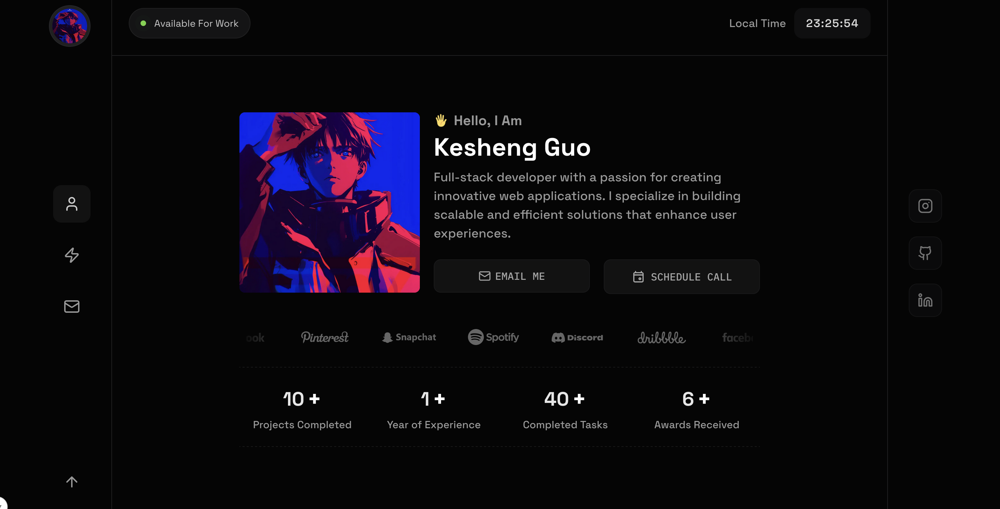

# Kesheng Guo - Personal Portfolio

A modern, responsive personal portfolio website built with Next.js, showcasing my work as a full-stack developer.



## 🚀 Features

- **Modern Design** - Clean, dark-themed UI with smooth animations
- **Responsive Layout** - Optimized for all devices and screen sizes
- **Real-time Clock** - Live local time display
- **Interactive Animations** - Built with Framer Motion for smooth transitions
- **Contact Integration** - Direct email and scheduling functionality
- **Social Media Links** - Connected to various social platforms
- **Project Showcase** - Dynamic project cards with live demos
- **Skills Display** - Interactive tech stack visualization

## 🛠️ Tech Stack

- **Frontend:** Next.js 15, TypeScript
- **Styling:** Tailwind CSS
- **Animations:** Framer Motion
- **Icons:** Lucide React
- **Image Optimization:** Next.js Image
- **Deployment:** Vercel

## 📱 Sections

- **Hero Section** - Personal introduction with avatar and quick contact
- **About** - Professional background and expertise
- **Services** - Development services offered
- **Projects** - Portfolio showcase with live links
- **Skills** - Technology stack and proficiency
- **Contact** - Multiple ways to get in touch

## 🎨 Design Features

- Dark theme with custom color palette
- Hover animations and transitions
- Counter animations for statistics
- Social media brand integrations
- Mobile-first responsive design


## 🔧 Getting Started

1. **Clone the repository**
   ```bash
   git clone https://github.com/ksguo/my-portfolio.git
   cd my-portfolio
   ```

2. **Install dependencies**
   ```bash
   npm install
   ```

3. **Set up environment variables**
   ```bash
   cp .env.example .env.local
   ```
   Update the variables with your information:
   ```
   NEXT_PUBLIC_TO_EMAIL="your@email.com"
   ```

4. **Run the development server**
   ```bash
   npm run dev
   ```

5. **Open your browser**
   Navigate to [http://localhost:3000](http://localhost:3000)

## 📁 Project Structure

```
my-portfolio/
├── app/                    # Next.js app directory
│   ├── globals.css        # Global styles
│   ├── layout.tsx         # Root layout
│   └── page.tsx           # Home page
├── components/            # React components
│   ├── Hero/             # Hero section
│   ├── Header/           # Navigation and header
│   ├── MyServices/       # Services section
│   ├── ShowCase/         # Project showcase
│   ├── ContactForm/      # Contact form
│   └── ui/               # Reusable UI components
├── data/                 # Static data and content
├── providers/            # Context providers
├── types/                # TypeScript type definitions
├── public/               # Static assets
└── animation/            # Framer Motion variants
```

## 🚀 Deployment

This project is deployed on [Vercel](https://vercel.com). To deploy your own version:

1. Fork this repository
2. Connect your GitHub account to Vercel
3. Import the project
4. Configure environment variables
5. Deploy!

## 📄 License

This project is open source and available under the [MIT License](LICENSE).

## 🙏 Inspiration

This portfolio is inspired by [psparwez/portfolio](https://github.com/psparwez/portfolio). Thanks for the amazing design inspiration!

